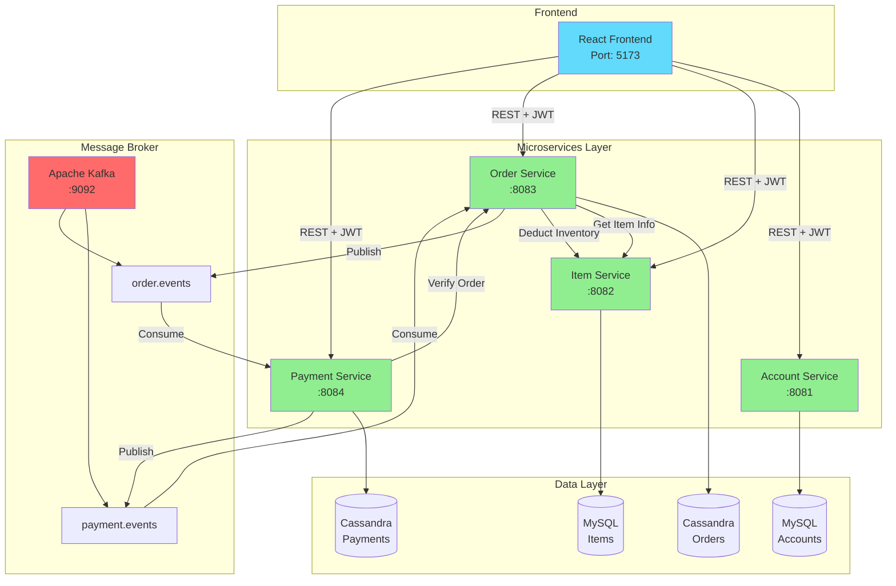
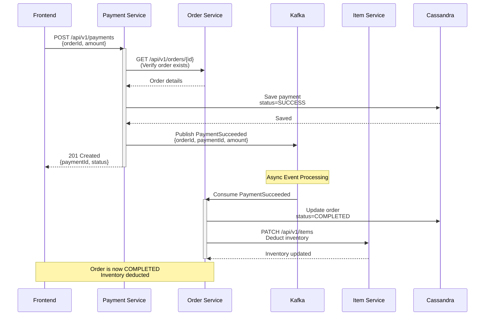
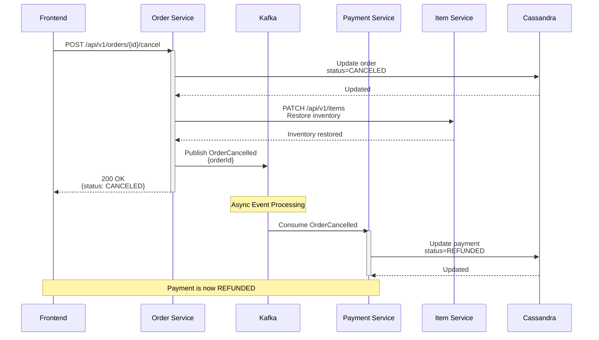
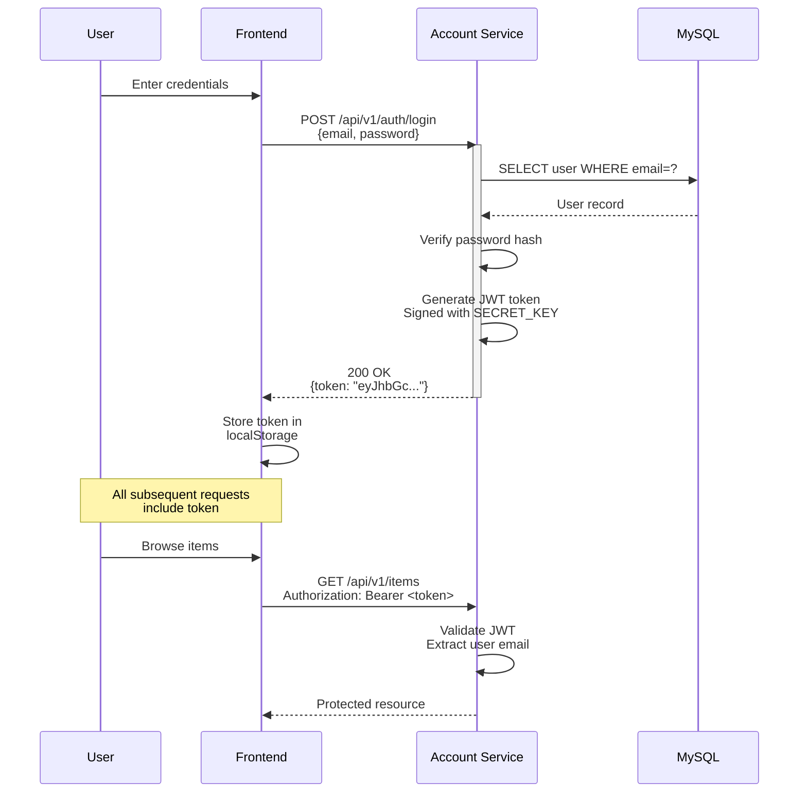
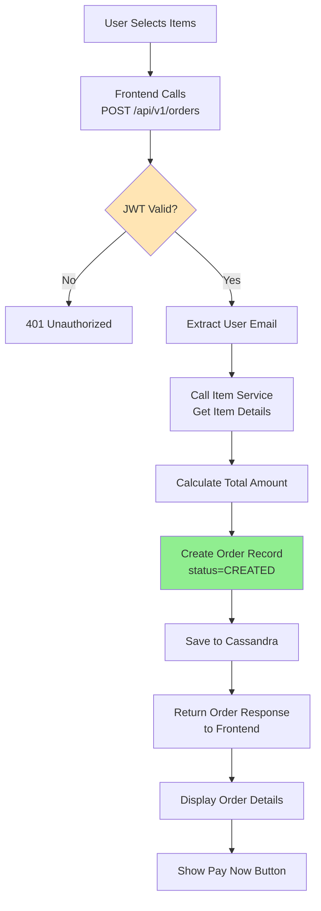
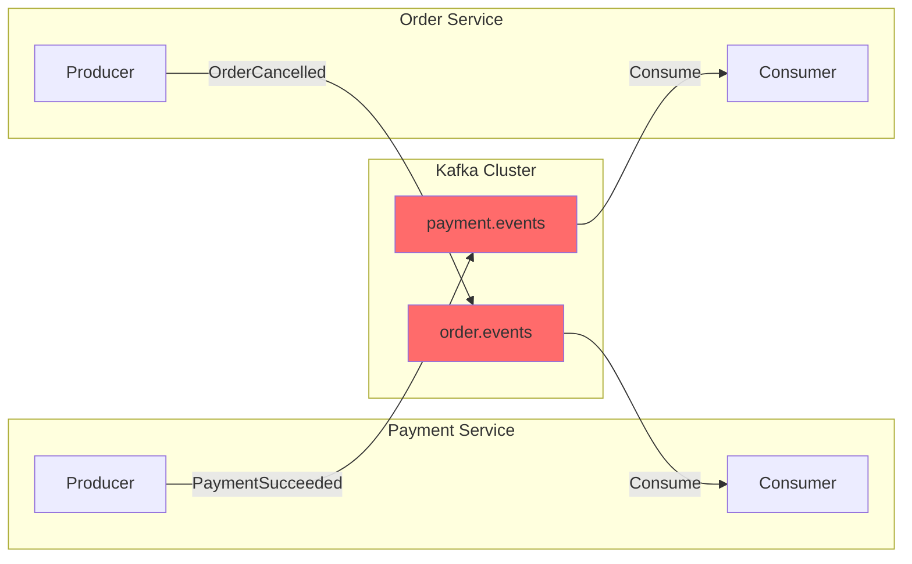
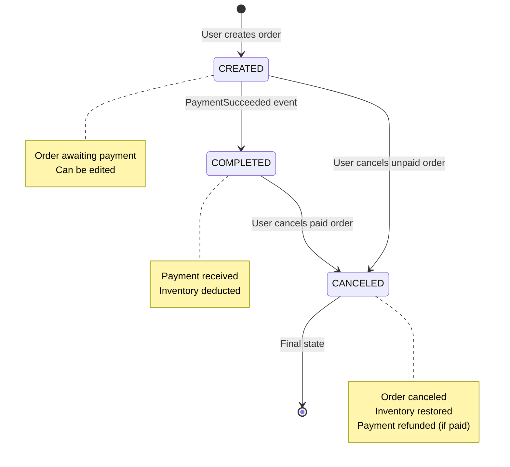
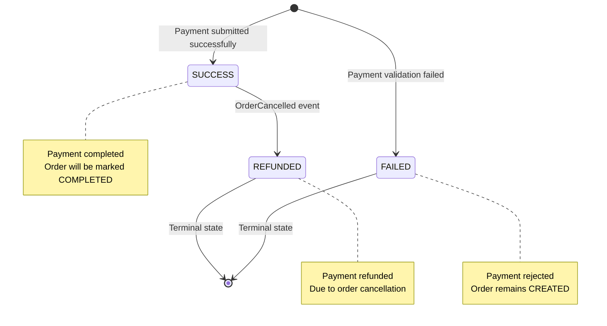
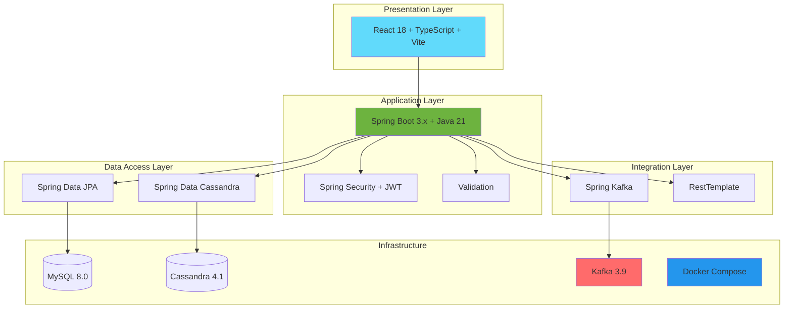

# 🎨 Visual Flow Diagrams (Mermaid)

## System Architecture Overview



## Payment & Order Completion Flow



## Order Cancellation & Refund Flow



## User Journey: Complete Purchase Flow

```mermaid
graph LR
    A[User Opens App] --> B[Login/Register]
    B --> C[Browse Items]
    C --> D[Create Order]
    D --> E{Order Created<br/>Status: CREATED}
    E --> F[Click Pay Now]
    F --> G[Enter Amount]
    G --> H[Submit Payment]
    H --> I{Payment Success?}
    I -->|Yes| J[Publish PaymentSucceeded]
    I -->|No| K[Payment Failed]
    J --> L[Order Marked COMPLETED]
    L --> M[Inventory Deducted]
    M --> N[View Order Details]
    N --> O{Cancel Order?}
    O -->|Yes| P[Order Canceled]
    P --> Q[Publish OrderCancelled]
    Q --> R[Payment Refunded]
    R --> S[Inventory Restored]
    O -->|No| T[Order Complete]
    K --> U[Try Again]
    
    style E fill:#FFA500
    style L fill:#90EE90
    style P fill:#FF6B6B
    style R fill:#87CEEB
```



## Authentication Flow



## Service-to-Service Communication

```mermaid
graph TB
    subgraph "Synchronous (REST)"
        PS[Payment Service] -->|GET /orders/{id}| OS[Order Service]
        OS -->|GET /items| IS[Item Service]
        OS -->|PATCH /items| IS
        style PS fill:#FFE5B4
        style OS fill:#FFE5B4
        style IS fill:#FFE5B4
    end
    
    subgraph "Asynchronous (Kafka Events)"
        PS2[Payment Service] -.->|PaymentSucceeded| K[Kafka]
        K -.->|PaymentSucceeded| OS2[Order Service]
        OS2 -.->|OrderCancelled| K
        K -.->|OrderCancelled| PS2
        style PS2 fill:#B4E5FF
        style OS2 fill:#B4E5FF
        style K fill:#FF6B6B
    end
```

## Data Flow: Create Order



## Kafka Event Architecture



## State Machine: Order Lifecycle



## State Machine: Payment Lifecycle



## Technology Stack



---

## How to Use These Diagrams

### 1. **GitHub Rendering**
- These Mermaid diagrams will automatically render on GitHub
- Just push the `.md` file and view it

### 2. **VS Code**
- Install "Markdown Preview Mermaid Support" extension
- Preview the file

### 3. **Export to Images**
- Use [Mermaid Live Editor](https://mermaid.live/)
- Copy/paste the diagram code
- Export as PNG/SVG

### 4. **PowerPoint/Presentations**
- Export diagrams as PNG
- Import into slides
- Or use "Mermaid for PowerPoint" add-in

### 5. **Documentation Sites**
- Most static site generators support Mermaid
- Docusaurus, VuePress, GitBook, etc.

---

**Created**: November 15, 2025  
**Format**: Mermaid Diagrams  
**Purpose**: Demo & Presentation

